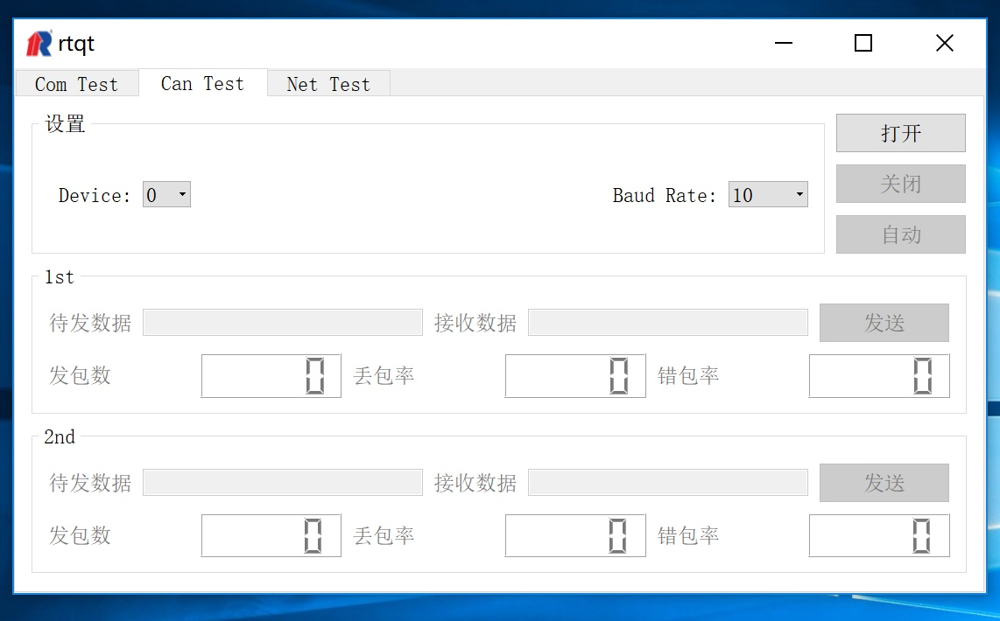
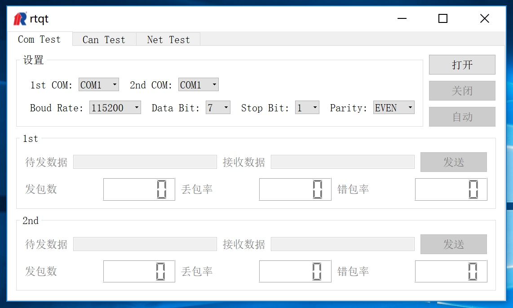
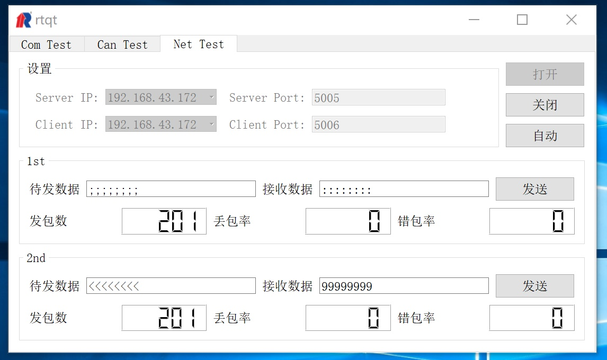

# rtqt #
## 简介 ##
本项目是常熟瑞特计算机事业部加固机测试软件开发项目.开发此款软件目的是为了保证加固计算机在出厂时的软硬件质量,提升调试测试人员的工作效率,提升部门加固计算机产值.软件的基本功能至少包括:CAN卡测试,串口卡测试,网卡测试.后续纳入考虑的功能还包括测试报表生成,常规外设测试(鼠标,键盘等).

项目软件采用C++语言开发,采用Qt4做GUI开发,需要支持windows和vxworks两种平台.

## 测试原理 ##
加固计算机具有模块化的特点, 可有多个通信端口, 采用本软件测试时, 用户任意选择两个可用端口做收发包测试, 因此要求在测试前连接好相关端口, 对于网口只需都连接交换机并配置ip即可.

## 软件特点 ##

  1. 跨平台, 支持windows和vxworks.
  2. 支持对设备的CAN, COM, NET基本通信功能的测试.
  3. 采用google test和google mock搭建单元测试框架.
  4. 支持log记录收发数据.
  5. 支持收发包统计.
  6. 软件直接运行在待测设备上, 无需额外测试PC.

## 特殊说明 ##

  1. CAN通信功能依赖硬件驱动, 因此不具备移植性.

## 软件截图 ##

  
  
  
  
  
